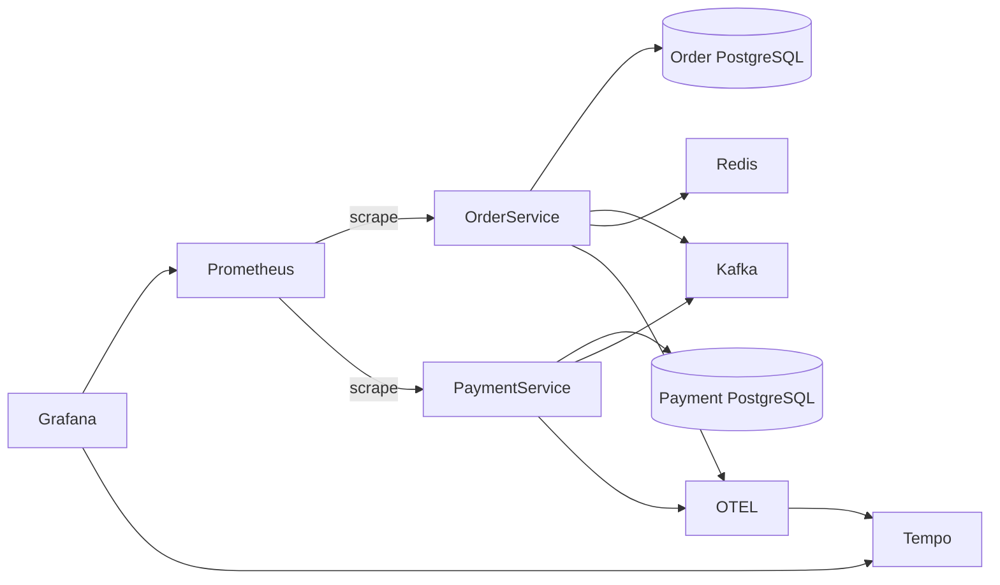
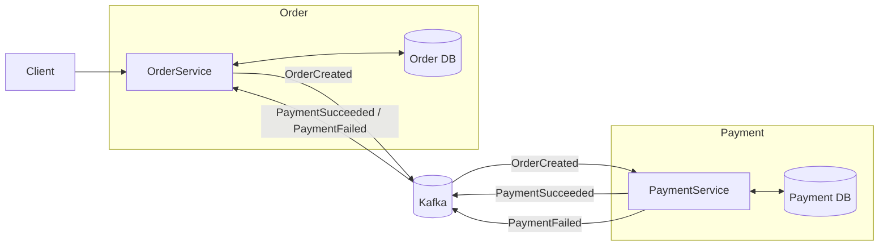

# Order Payment Service
Event-driven order and payment processing system built with Spring Boot, Kafka and Docker.
The system demonstrates asynchronous communication between microservices using Apache Kafka, reliable event publishing with Transactional Outbox, and application observability using OpenTelemetry, Prometheus and Grafana.

## Technologies
### Backend
- Java 21
- Spring Boot 3
- Spring Data JPA
- Spring Kafka
### Messaging
- Apache Kafka
### Databases
- PostgreSQL
- Redis
### Infrastructure
- Docker
- Docker Compose
### Observability
- Micrometer
- Prometheus
- Grafana
- Loki
- Tempo
- OpenTelemetry
## Testing
Tests are implemented using:
- JUnit 5
- Mockito
- Spring Boot Test

## Infrastructure



## Architecture
The application consists of two independent microservices:

- **Order Service** – implemented using the **Layered Architecture** pattern.
- **Payment Service** – implemented using the **Hexagonal (Ports and Adapters) Architecture** pattern.

Both services are containerized and run together using a single **Docker Compose** configuration. Supporting infrastructure (such as Kafka and the database) is also managed by Docker Compose.

## Project Structure

### Order Service
- **config** – application configuration
- **dto** – data transfer objects
- **exception** – exception handling
- **kafka** – Kafka events and messaging
- **observability**
    - **metrics** – custom application metrics
- **order**
    - **controller** – REST API endpoints
    - **service** – business logic
    - **repository** – data access
    - **entity** – domain entities

### Payment Service
- **payment** – core payment module following hexagonal architecture:
    - **api** – REST controllers and incoming adapters
    - **application** – application use cases
    - **domain** – business logic and domain models
    - **infrastructure** – database and external adapters

- **messaging** – Kafka communication layer:
    - **config** – Kafka configuration
    - **consumer** – Kafka consumers
    - **event** – messaging events
    - **producer** – Kafka producers

- **outbox** – Transactional Outbox implementation:
    - **application** – outbox processing logic
    - **domain** – outbox entities and models
    - **config** – outbox configuration

## Communication
The services communicate asynchronously through Apache Kafka.
External clients communicate with the Order Service through REST API.



Communication flow:
1. Order Service creates a new order.
2. Order Service publishes an `OrderCreated` event to Kafka.
3. Payment Service consumes the event and processes the payment.
4. Payment Service publishes either a `PaymentSucceeded` or `PaymentFailed` event.
5. Order Service consumes the payment event and updates the order status.

This event-driven approach keeps the services loosely coupled and allows them to operate independently.

## Transactional Outbox Pattern

Payment Service uses the Transactional Outbox pattern to guarantee reliable event publishing.

Flow:

1. Payment state change is stored in PostgreSQL.
2. Event is saved into the outbox table within the same transaction.
3. Outbox publisher periodically reads unpublished events and sends them to Kafka.
4. Published events are marked as completed.

This prevents data inconsistency between database state and Kafka events.

### Order Service (Layered Architecture)
The Order Service follows the traditional layered architecture:
- **Controller** – handles HTTP requests.
- **Service** – contains business logic.
- **Repository** – handles data persistence.
- **Entity** – represents the domain model.

### Payment Service (Hexagonal Architecture)
The Payment Service follows the Hexagonal (Ports and Adapters) Architecture. Besides the core hexagonal layers, it contains dedicated modules for messaging and the Transactional Outbox pattern.

- **api** – REST controllers and Kafka consumers that receive incoming requests and events.
- **application** – application use cases that orchestrate the business workflow.
- **domain** – business entities, domain services, and port interfaces.
- **infrastructure** – implementations of persistence, messaging, and external integrations.
- **messaging** – Kafka producers and consumers responsible for asynchronous communication.
- **outbox** – implementation of the Transactional Outbox pattern, ensuring reliable event publishing.

## Domain Rules
- Order amount cannot be negative.
- Order status can change only from `NEW` to `PAID` or `FAILED`.
- A `PAID` order cannot transition to `FAILED`.

## Metrics (Prometheus)
### Order Service
| Metric | Description |
|--------|-------------|
| `order_total` | Orders created |
| `order_create_time_seconds` | Order creation time |
| `order_create_time_seconds_max` | Maximum order creation time |
| `order_failed_total` | Failed orders |
| `order_succeeded_total` | Successful orders |
### Payment Service
| Metric | Description |
|--------|-------------|
| `payments_processing_time_seconds` | Payment processing time |
| `payments_processing_time_seconds_max` | Maximum payment processing time |
| `payments_failed_total` | Failed payments |
| `payments_success_total` | Successful payments |

## Running the application
```bash
cd backup
docker compose up --build
```
After startup:

| Service | URL |
|---|---|
| Order Service | http://localhost:8080 |
| Payment Service | http://localhost:8082 |
| Kafka UI | http://localhost:8081 |
| Grafana | http://localhost:3000 |
| Prometheus | http://localhost:9090 |

Actuator endpoints:

| Endpoint | Description |
|---|---|
| `/actuator/health` | Application health |
| `/actuator/prometheus` | Prometheus metrics |

## API Example

Create order:

```bash
curl -X POST http://localhost:8080/orders \
-H "Content-Type: application/json" \
-d '{
  "amount":100
}'
```
Example response:
```
{
    "id": 1,
    "status": "NEW",
    "amount": 100
}
```