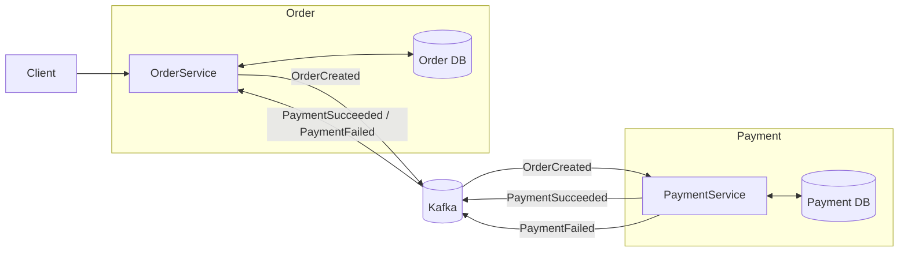

# order-payment-service
## Technologies
- Java 21
- Spring Boot 3
- Spring Data JPA
- Apache Kafka
- PostgreSQL
- Redis
- Docker & Docker Compose
- Micrometer + Prometheus

## Architecture
The application consists of two independent microservices:

- **Order Service** – implemented using the **Layered Architecture** pattern.
- **Payment Service** – implemented using the **Hexagonal (Ports and Adapters) Architecture** pattern.

Both services are containerized and run together using a single **Docker Compose** configuration. Supporting infrastructure (such as Kafka and the database) is also managed by Docker Compose.

## Communication
The services communicate asynchronously through **Apache Kafka**.



Communication flow:
1. Order Service creates a new order.
2. Order Service publishes an `OrderCreated` event to Kafka.
3. Payment Service consumes the event and processes the payment.
4. Payment Service publishes either a `PaymentSucceeded` or `PaymentFailed` event.
5. Order Service consumes the payment event and updates the order status.

This event-driven approach keeps the services loosely coupled and allows them to operate independently.

### Order Service (Layered Architecture)
The Order Service follows the traditional layered architecture:
- **Controller** – handles HTTP requests.
- **Service** – contains business logic.
- **Repository** – handles data persistence.
- **Entity** – represents the domain model.

### Payment Service (Hexagonal Architecture)
The Payment Service follows the Hexagonal (Ports and Adapters) Architecture. Besides the core hexagonal layers, it contains dedicated modules for messaging and the Transactional Outbox pattern.

- **api** – REST controllers and Kafka consumers that receive incoming requests and events.
- **application** – application use cases that orchestrate the business workflow.
- **domain** – business entities, domain services, and port interfaces.
- **infrastructure** – implementations of persistence, messaging, and external integrations.
- **messaging** – Kafka producers and consumers responsible for asynchronous communication.
- **outbox** – implementation of the Transactional Outbox pattern, ensuring reliable event publishing.

## DOMAIN RULES
- Order amount cannot be negative.
- Order status can change only from `NEW` to `PAID` or `FAILED`.
- A `PAID` order cannot transition to `FAILED`.

## Metrics (Prometheus)
### Order Service
| Metric | Description |
|--------|-------------|
| `order_total` | Orders created |
| `order_create_time_seconds` | Order creation time |
| `order_create_time_seconds_max` | Maximum order creation time |
| `order_failed_total` | Failed orders |
| `order_succeeded_total` | Successful orders |
### Payment Service
| Metric | Description |
|--------|-------------|
| `payments_processing_time_seconds` | Payment processing time |
| `payments_processing_time_seconds_max` | Maximum payment processing time |
| `payments_failed_total` | Failed payments |
| `payments_success_total` | Successful payments |

## Running the application
```bash
cd backup
docker compose up --build
```
After startup:
- Order Service: `http://localhost:8080`
- Payment Service: `http://localhost:8082`
- Prometheus metrics: `/actuator/prometheus`